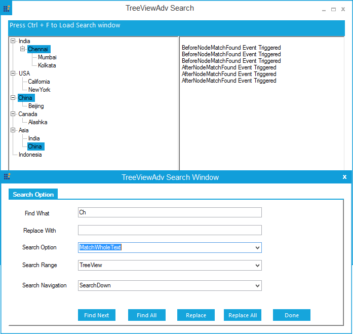
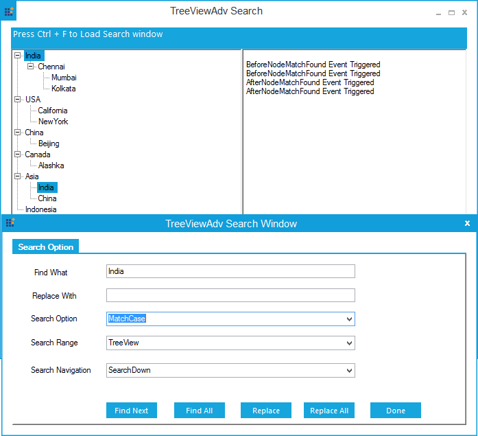
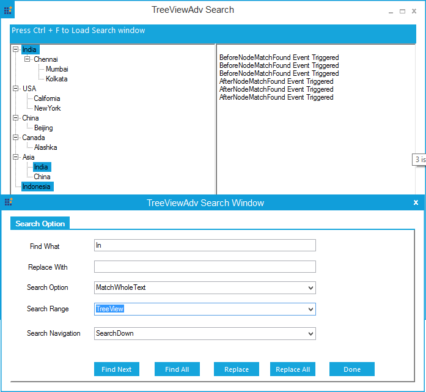
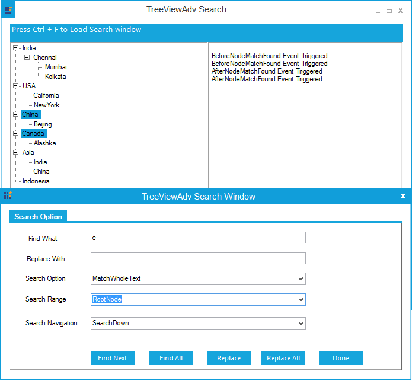
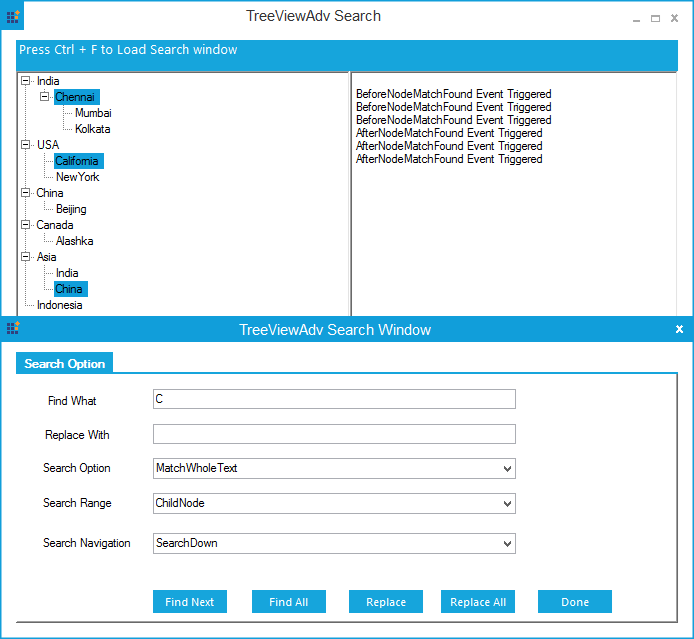

# How to search and retrieve the tree node based on its text in winforms treeviewadv?

## Search and retrieve the TreeNodeAdv text

**TreeViewAdv** has built-in support to search the **TreeNodeAdv** based on its text, by using the class named **TreeViewAdvFindReplaceDialog**. It can be done using the following categories:
1. TreeViewSearchOption
2. TreeViewSearchRange
3. TreeViewSearchNavigation

## TreeViewSearchOption
This property specifies the Searching option in TreeViewAdv.
1. MatchWholeText
2. MatchCase

## MatchWholeText

This option helps match the whole searched text with the **TreeNodeAdv** text, while performing a search in **TreeViewAdv**.
 
The screenshot below illustrates the TreeViewAdv performing search option with **MatchWholeText**



## MatchCase

This option specifies whether casing needs to be considered during the search process.
 
The screenshot below illustrates the TreeViewAdv performing search option with **MatchCase**



## TreeViewSearchRange

This property helps to specify the search range in **TreeViewAdv** during the search process. These options are categorized as follows.
1. TreeView
2. RootNode
3. ChildNode

## TreeView

This option helps specify whether the search needs to be performed with all levels of **TreeNodeCollection** in **TreeViewAdv**.
 
The screenshot below illustrates the TreeViewAdv performing search range with **TreeView**



## RootNode

This option helps to specify whether the search needs to be performed only with the parent level of the **TreeNodeAdv**.

The screenshot below illustrates the TreeViewAdv performing search range with **RootNode**

 

## ChildNode

This option helps to specify, whether the search needs to be performed only with the child level of **TreeNodeAdv**.

The screenshot below illustrates the TreeViewAdv performing search range with **ChildNode**

 

## TreeViewSearchNavigation

This property helps to specify the navigation option for **TreeViewAdv**, upon using find and replace in the **TreeNodeAdv** process in **TreeViewAdv**. These options are categorized as follows:
1. SearchUp
2. SearchDown
3. SearchAll

## SearchUp

This option helps to specify whether the search needs to be performed from the bottom to the top of TreeViewAdv.

## SearchDown

This option helps to specify whether the search needs to be performed from the top to the bottom of TreeViewAdv.

## SearchAll

This option helps to specify whether the search can be performed in the above cases repeatedly. The following code example demonstrates the same.

**C# Code snippet:**

```C#
//Initialize the TreeViewSearchForm
TreeViewSearchForm form;
//To assign the TreeViewAdv to TreeViewSearchForm
form = new TreeViewSearchForm(this.treeViewAdv1);
//To show the search dialog
void treeViewAdv1_PreviewKeyDown(object sender, PreviewKeyDownEventArgs e)
{
    if (e.Modifiers == Keys.Control && e.KeyValue == (Char)Keys.F)
    {
        form = new TreeViewSearchForm(this.treeViewAdv1);
        form.ShowDialog();
    }
}

public partial class TreeViewSearchForm : MetroForm
{
    //Initialize the TreeViewAdvFindReplaceDialog
    TreeViewAdvFindReplaceDialog dialog = null;
    //Initialize the TreeViewAdv
    private TreeViewAdv TreeView;
        //To pass the TreeviewAdv argument to the form.
    public TreeViewSearchForm(TreeViewAdv tree)
    {
        InitializeComponent();
        TreeView = tree;
        //To assign the TreeViewAdv to TreeViewSearchForm            
        dialog = new TreeViewAdvFindReplaceDialog(this.TreeView);
    }
    //To get the TreeViewSearchNavigation
    void comboBox3_SelectedIndexChanged(object sender, EventArgs e)
    {
        dialog.TreeViewSearchNavigation = (TreeViewSearchNavigation)this.SearchRangeCombo.Items[this.comboBox3.Items.IndexOf(this.comboBox3.SelectedItem)];
    }
    //To get the TreeViewSearchRange
    private void SearchRangeCombo_SelectedIndexChanged(object sender, EventArgs e)
    {
        dialog.TreeViewSearchRange = (TreeViewSearchRange)this.SearchRangeCombo.Items[this.SearchRangeCombo.Items.IndexOf(this.SearchRangeCombo.SelectedItem)];
    }
    //To get the TreeViewSearchOption
    private void SearchOptionCombo_SelectedIndexChanged(object sender, EventArgs e)
    {
        dialog.TreeViewSearchOption = (TreeViewSearchOption)this.SearchOptionCombo.Items[this.SearchOptionCombo.Items.IndexOf(this.SearchOptionCombo.SelectedItem)];
    }
    //To Find TreeNodeAdv
    private void button1_Click(object sender, EventArgs e)
    {
        dialog.Find(this.findTextBox.Text);
    }
    //To Find All the TreeNodeAdv
    private void button2_Click(object sender, EventArgs e)
    {
        dialog.FindAll(this.findTextBox.Text);
    }
    //To Replace the TreeNodeAdv
    private void button3_Click(object sender, EventArgs e)
    {
        this.TreeView.SelectedNodes.Clear();
        if(dialog.Find(this.findTextBox.Text))
            dialog.Replace(this.replaceTextbox.Text);
    }
    //To Replace All the TreeNodeAdv
    private void button4_Click(object sender, EventArgs e)
    {
        this.TreeView.SelectedNodes.Clear();
        if (dialog.FindAll(this.findTextBox.Text))
            dialog.ReplaceAll(this.replaceTextbox.Text);
    }
}

```

**VB Code snippet:**

```VB

'Initialize the TreeViewSearchForm
Private form As TreeViewSearchForm
'To assign the TreeViewAdv to TreeViewSearchForm
form = New TreeViewSearchForm(Me.treeViewAdv1)
'To show the search dialog
Private Sub treeViewAdv1_PreviewKeyDown(ByVal sender As Object, ByVal e As PreviewKeyDownEventArgs)
   If e.Modifiers = Keys.Control AndAlso e.KeyValue = Keys.F Then
       form = New TreeViewSearchForm(Me.treeViewAdv1)
       form.ShowDialog()
   End If
End Sub

Partial Public Class TreeViewSearchForm
    Inherits MetroForm
    'Initialize the TreeViewAdvFindReplaceDialog
    Private dialog As TreeViewAdvFindReplaceDialog = Nothing
    'Initialize the TreeViewAdv
    Private TreeView As TreeViewAdv
    'To pass the TreeviewAdv argument to the form.
    Public Sub New(ByVal tree As TreeViewAdv)
        InitializeComponent()
        TreeView = tree
        'To assign the TreeViewAdv to TreeViewSearchForm            
        dialog = New TreeViewAdvFindReplaceDialog(Me.TreeView)
    End Sub
    'To get the TreeViewSearchNavigation
    Private Sub comboBox3_SelectedIndexChanged(ByVal sender As Object, ByVal e As EventArgs)
       dialog.TreeViewSearchNavigation = CType(Me.SearchRangeCombo.Items(Me.comboBox3.Items.IndexOf(Me.comboBox3.SelectedItem)), TreeViewSearchNavigation)
    End Sub
    'To get the TreeViewSearchRange
    Private Sub SearchRangeCombo_SelectedIndexChanged(ByVal sender As Object, ByVal e As EventArgs) Handles SearchRangeCombo.SelectedIndexChanged
       dialog.TreeViewSearchRange = CType(Me.SearchRangeCombo.Items(Me.SearchRangeCombo.Items.IndexOf(Me.SearchRangeCombo.SelectedItem)), TreeViewSearchRange)
    End Sub
    'To get the TreeViewSearchOption
    Private Sub SearchOptionCombo_SelectedIndexChanged(ByVal sender As Object, ByVal e As EventArgs) Handles SearchOptionCombo.SelectedIndexChanged
       dialog.TreeViewSearchOption = CType(Me.SearchOptionCombo.Items(Me.SearchOptionCombo.Items.IndexOf(Me.SearchOptionCombo.SelectedItem)), TreeViewSearchOption)
    End Sub
    'To Find TreeNodeAdv
    Private Sub button1_Click(ByVal sender As Object, ByVal e As EventArgs) Handles button1.Click
       dialog.Find(Me.findTextBox.Text)
    End Sub
    'To Find All the TreeNodeAdv
    Private Sub button2_Click(ByVal sender As Object, ByVal e As EventArgs) Handles button2.Click
       dialog.FindAll(Me.findTextBox.Text)
    End Sub
    'To Replace the TreeNodeAdv
    Private Sub button3_Click(ByVal sender As Object, ByVal e As EventArgs) Handles button3.Click
       Me.TreeView.SelectedNodes.Clear()
       If dialog.Find(Me.findTextBox.Text) Then
         dialog.Replace(Me.replaceTextbox.Text)
       End If
    End Sub
    'To Replace All the TreeNodeAdv
    Private Sub button4_Click(ByVal sender As Object, ByVal e As EventArgs) Handles button4.Click
       Me.TreeView.SelectedNodes.Clear()
       If dialog.FindAll(Me.findTextBox.Text) Then
         dialog.ReplaceAll(Me.replaceTextbox.Text)
       End If
    End Sub
End Class

```
